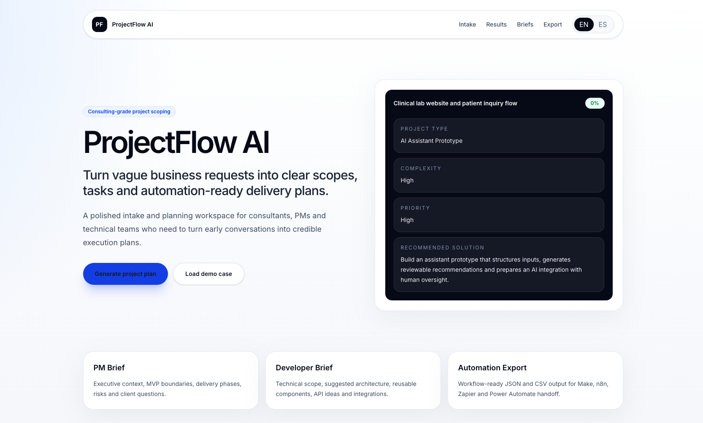
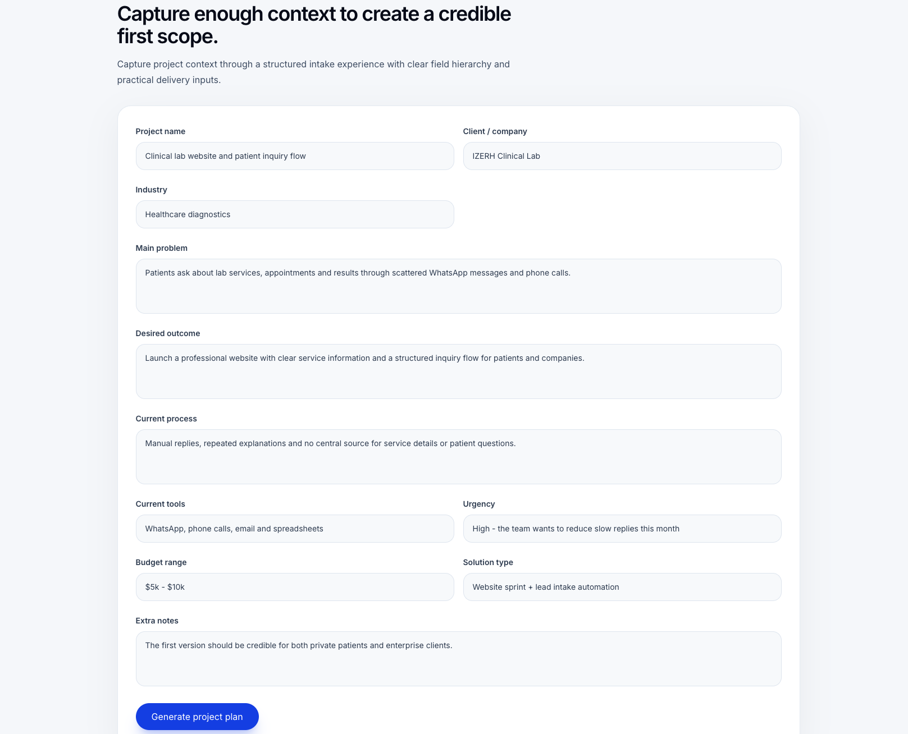
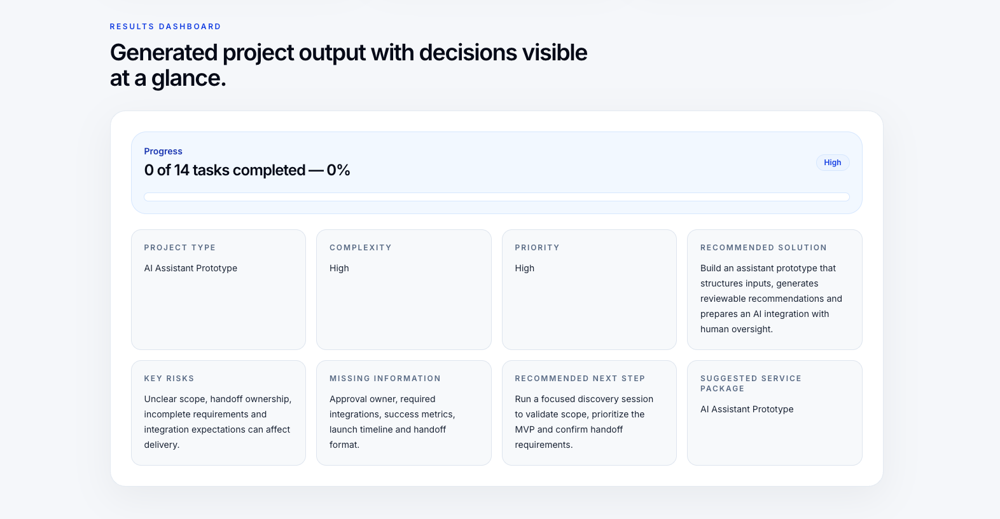
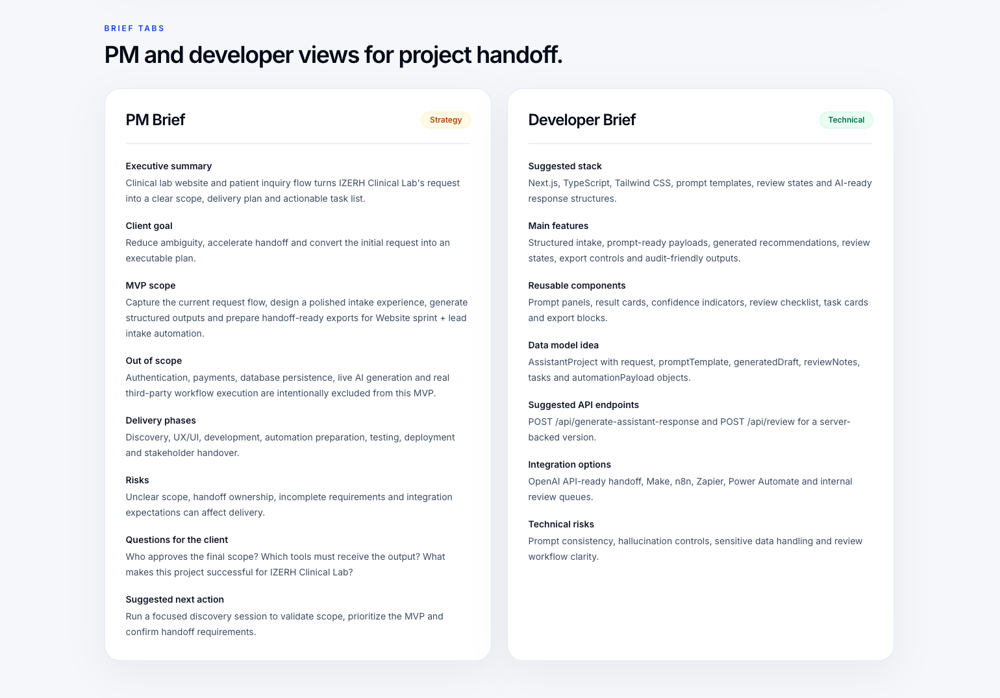
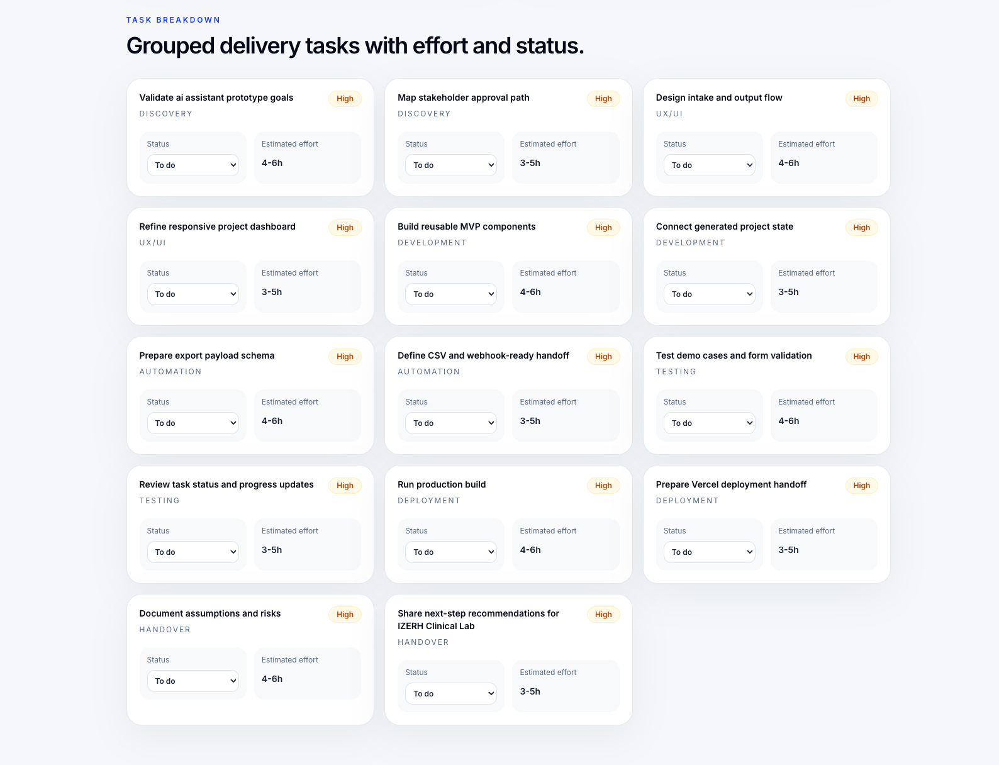
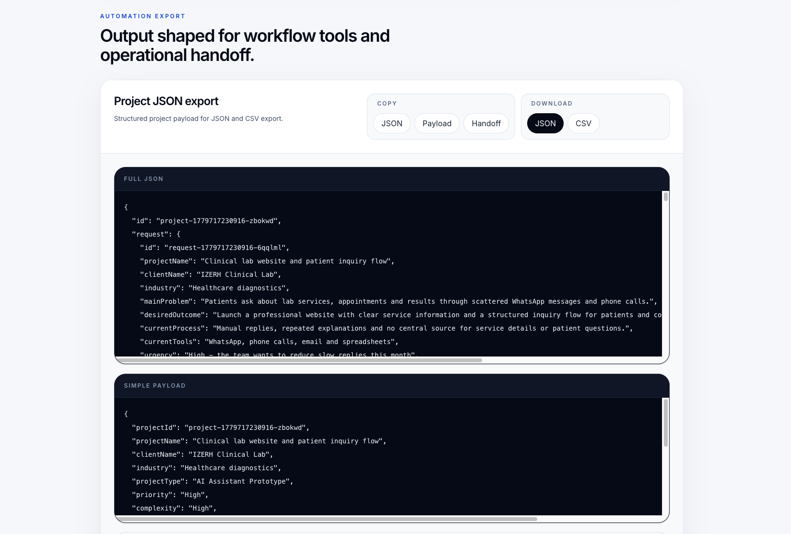

# ProjectFlow AI

ProjectFlow AI is a project intake and delivery planning tool that transforms vague business requests into structured project scopes, PM briefs, developer briefs, task breakdowns and automation-ready outputs.

## Live Demo

[ProjectFlow AI](https://projectflow-ai-chi.vercel.app/)

## Screenshots

### Hero

### Structured Intake

### Generated Analysis

### PM and Developer Briefs

### Task Breakdown

### Automation Export

## Problem

Project managers, consultants and technical teams often receive vague or incomplete project requests. Before execution can start, those requests need to be clarified, scoped, prioritized and translated into concrete tasks.

## Solution

ProjectFlow AI provides a structured intake flow that turns raw business context into:

- Project analysis
- PM Brief
- Developer Brief
- Task breakdown
- Progress tracking
- JSON/CSV exports
- Automation-ready payloads

## Features

- Project intake form
- Demo case loading
- Rule-based project classification
- PM Brief generation
- Developer Brief generation
- Task breakdown by delivery phase
- Task status management
- Project progress tracking
- LocalStorage project history
- JSON export
- CSV task export
- English/Spanish UX switcher
- Responsive SaaS-style interface

## Tech Stack

- Next.js
- React
- TypeScript
- Tailwind CSS
- LocalStorage
- Vercel
- GitHub

## Demo Use Cases

### Clinical Lab Website + Patient Inquiry Flow

A clinical lab needs a modern website and structured patient inquiry flow to reduce repetitive WhatsApp communication.

### Tattoo Studio Lead Intake + Booking Workflow

A tattoo studio receives unstructured requests through Instagram and WhatsApp and needs a better intake and booking workflow.

### Internal Consulting Request Intake

A consulting team needs to capture vague internal project requests and transform them into structured briefs and tasks.

## Architecture

The project separates UI, generation logic, demo data, storage and exports:

- `components/` — reusable UI sections
- `lib/generators.ts` — rule-based project generation logic
- `lib/demoCases.ts` — demo project data
- `lib/storage.ts` — localStorage helpers
- `lib/exportUtils.ts` — JSON and CSV export helpers
- `types/project.ts` — TypeScript project types

## Current MVP Scope

This MVP intentionally avoids authentication, database persistence and external AI APIs to keep the product lightweight and focused on the core workflow.

## Future Improvements

- Improve generation quality
- Add OpenAI API support
- Add Supabase/PostgreSQL persistence
- Add user accounts
- Add real workflow integrations
- Add Power Automate / Make / n8n / Zapier webhook support
- Add team collaboration
- Add project templates

## What I Built

I designed and built ProjectFlow AI as a portfolio project to demonstrate full-stack product thinking, digital solution design, automation-ready workflows and AI-assisted development practices.

The goal was not only to build a web interface, but to create a practical tool that could support project managers, consultants and technical teams during early project scoping.
